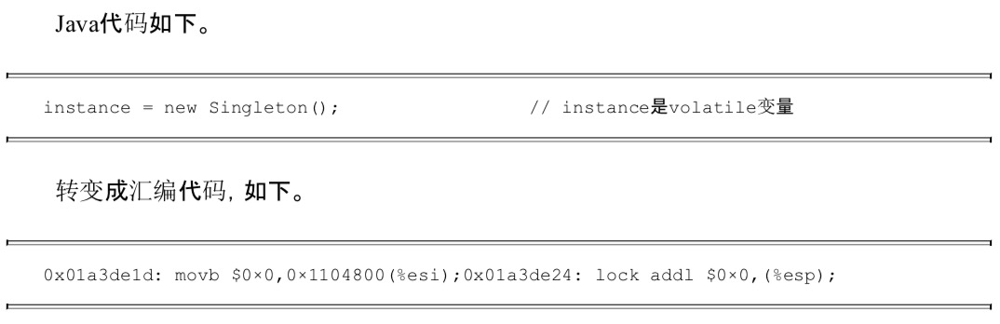

# volatile原理
## volatile的定义
      定义：Java编程语言允许线程访问共享对象，为了确保共享对象能被准确和一致更新，线程应使用排他锁单独获取这个变量。（即volatile保证了线程对共享对象的可见性。）
         
## 实现原理
   由volatile修饰的共享变量进行写操作的时候会多出一个lock前缀的汇编代码：
       

  这个lock前缀的指令在多核处理器下会引发：
   - 将当前处理器缓存行的数据写回到系统内存。
   - 这个写回内存的操作会使在其他CPU里缓存了该内存地址的数据无效。
     
volatile 的两条实现原则：
- Lock前缀指令会引起处理器缓存写回到内存。
- 一个处理器的缓存写回到内存会导致其他处理器的缓存无效（其他处理器在下次访问相同内存地址时，强制执行缓存行填充）。

## volatile优化
