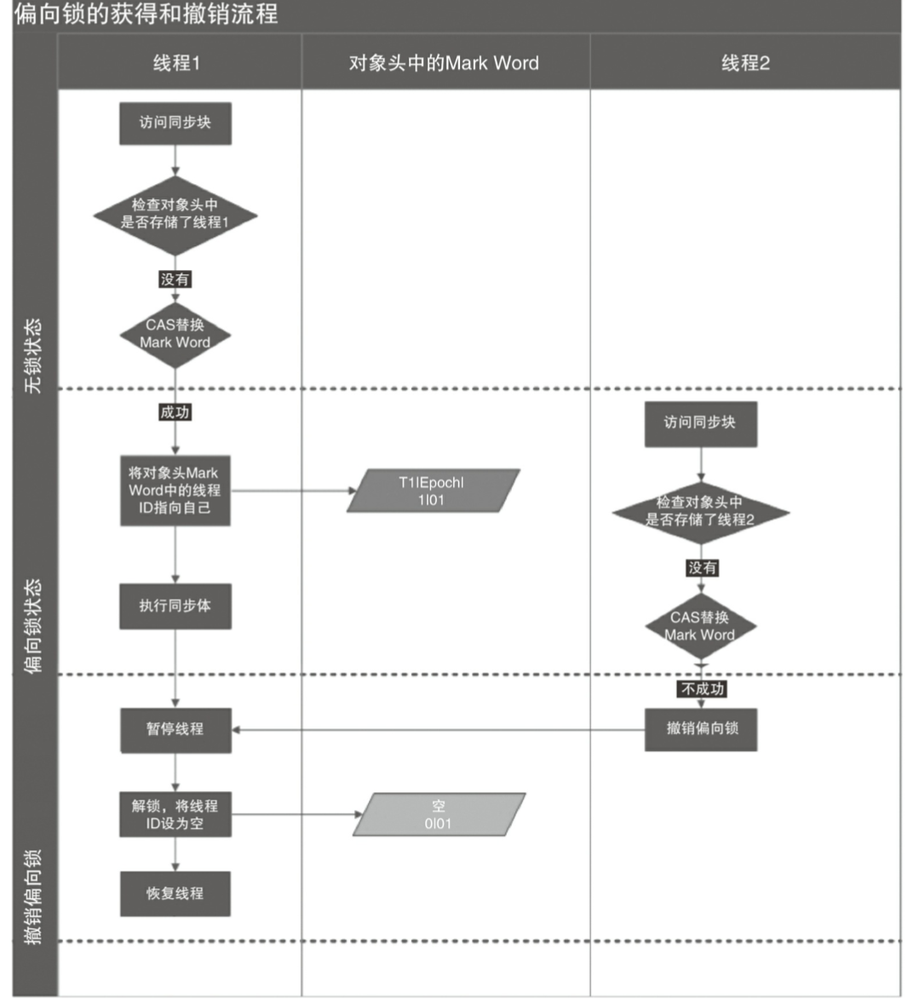
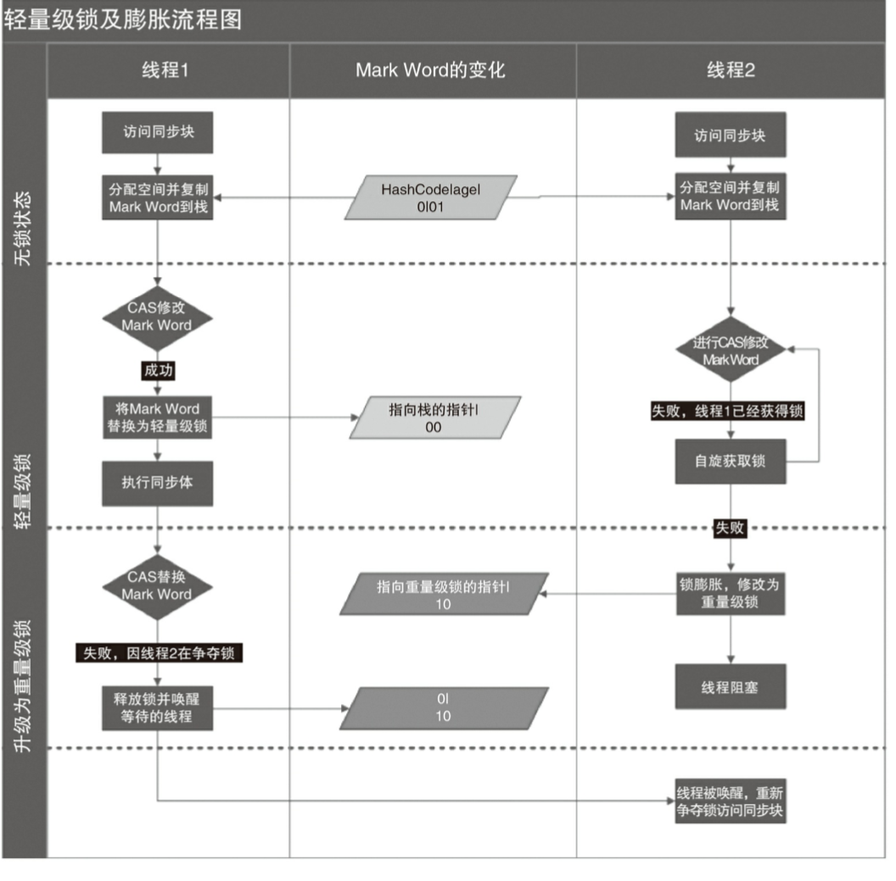

# 锁的升级和对比
   ***锁的状态***
   - 无锁状态
   - 偏向锁状态
   - 轻量级锁状态
   - 重量级锁状态
   
  这几个状态会随着竞争情况逐渐升级 但不能降级。

## 偏向锁
 ### 偏向锁场景
   
   偏向锁应用于锁不存在多线程竞争，而且总是由同一个线程多次获取。
   
 ### 偏向锁加锁

线程执行同步块的时候，JVM会先在当前线程栈帧中创建用于存储锁记录的空间。

当一个线程访问同步块并获取锁时，会在对象头MarkWord和当前栈帧中的锁记录存储偏向锁的线程ID（先检查 再用CAS机制记录owner）。

以后该线程进入或退出同步块不需要CAS操作来加锁和解锁，只需要简单测试一下对象头的Mark Word 里是否存储指向当前线程的偏向锁（与栈帧中锁记录对比）。

测试成功，即线程获得锁。

测试失败，则需要测试一下Mark Word 的锁设置标识是否1（偏向锁）：

若设置则尝试使用CAS将对象头的偏向锁指向当前线程（指向失败即解锁 升级为轻量级锁）。

若无设置即无锁状态 使用CAS竞争锁。

 ### 偏向锁撤销
 
偏向锁使用了一种等到竞争出现才释放锁的机制，所以当其他线程尝试竞争偏向锁时，持有偏向锁的线程才会释放锁。

偏向锁的撤销，需要等待全局安全点（在这个时间点上没有正
在执行的字节码）。

它会首先暂停拥有偏向锁的线程，然后检查持有偏向锁的线程是否活着，

如果线程不处于活动状态，则将对象头设置成无锁状
态；

如果线程仍然活着，拥有偏向锁的栈
会被执行，遍历偏向对象的锁记录，找中的锁记录和对象头的Mark Word要么重新偏向于其他
线程，要么恢复到无锁或者标记对象不适合作为偏向锁，最后唤醒暂停的线程。

### 偏向锁 流程图

##  轻量级锁
### 轻量级锁应用场景
   存在锁竞争但不激烈。可以通过自旋CAS优化。
### 轻量级锁加锁

   将mark word中的信息复制到当前线程的栈中，然后通过cas尝试修改mark word并替换成轻量锁。
   
   如果替换成功则执行同步代码。
   
   如果此时有线程2来竞争，并且他也尝试cas修改mark word但是失败了，那么线程2会进入自旋状态，如果在自旋状态也没有修改成功，那么轻量锁将膨胀成状态，mark word会被修改成重量锁标记(10) ,线程进入阻塞状态。
 
 ### 轻量级锁解锁
  会使用原子的CAS操作将栈帧中锁记录替换回到对象头。
  
  如果成功，则表示没有竞争发生。
  
  如果失败，表示当前锁存在竞争，锁膨胀成重量级锁。

### 轻量级锁流程图
